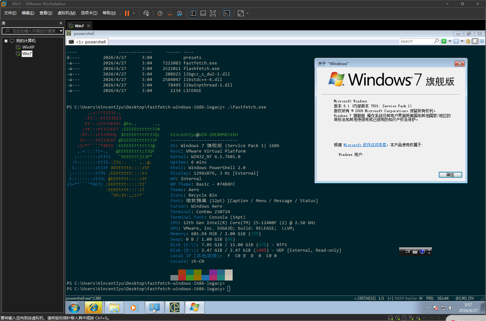

## Windows XP / Vista / 7（i686）旧版系统构建

> **[📖 English](README.md)** · **[📖 简体中文](README-cn.md)**

> 这是 **fastfetch** 针对 **32 位 Windows XP SP3 / Vista / 7** 的分支兼容构建。
> 原版项目支持 Windows 7+；此分支将其回溯至更早的系统。



### 快速链接

- 📖 **[构建指南 (简体中文)](.github/workflows/build-windows-i686-legacy.zh-cn.md)**
- 📖 **[Build Guide (English)](.github/workflows/build-windows-i686-legacy.md)**

---

> **以下是原始项目的 README：**

# Fastfetch

[](https://github.com/fastfetch-cli/fastfetch/actions)
[](https://github.com/fastfetch-cli/fastfetch/blob/dev/LICENSE)
[](https://github.com/fastfetch-cli/fastfetch/graphs/contributors)
[](https://github.com/fastfetch-cli/fastfetch/blob/dev/CMakeLists.txt#L5)
[](https://github.com/fastfetch-cli/fastfetch/commits)
[](https://formulae.brew.sh/formula/fastfetch#default)
[](https://github.com/fastfetch-cli/fastfetch/releases)
[](https://github.com/fastfetch-cli/fastfetch/releases)
[](https://repology.org/project/fastfetch/versions)
[](https://repology.org/project/fastfetch/versions)
[](https://deepwiki.com/fastfetch-cli/fastfetch)

Fastfetch 是一款类似 [neofetch](https://github.com/dylanaraps/neofetch) 的系统信息展示工具，主要用 C 编写，强调性能和可定制性。目前支持 Linux、macOS、Windows 7+、Android、FreeBSD、OpenBSD、NetBSD、DragonFly、Haiku 和 SunOS（illumos、Solaris）。

> 注意：Fastfetch 仅在 x86-64 和 aarch64 平台上经过主动测试。在其他平台上可能可以运行，但不保证。


示例配置文件位于[此处](https://github.com/fastfetch-cli/fastfetch/tree/dev/presets/examples)。

更多截图和平台说明见 [Wiki](https://github.com/fastfetch-cli/fastfetch/wiki)。

## 安装

### Linux

部分发行版打包的 fastfetch 版本可能较旧。旧版本不受支持，请尽量使用最新版本。

<a href="https://repology.org/project/fastfetch/versions">
    
</a>

* Ubuntu：[`ppa:zhangsongcui3371/fastfetch`](https://launchpad.net/~zhangsongcui3371/+archive/ubuntu/fastfetch)（Ubuntu 22.04 或更新版本；最新版）
* Debian / Ubuntu：`apt install fastfetch`（Debian 13 或更新版本；Ubuntu 25.04 或更新版本）
* Debian / Ubuntu：从 [GitHub Release 页面](https://github.com/fastfetch-cli/fastfetch/releases/latest) 下载 `fastfetch-linux-<架构>.deb` 并双击安装（适用于 Ubuntu 20.04+ 和 Debian 11+）
* Arch Linux：`pacman -S fastfetch`
* Fedora：`dnf install fastfetch`
* Gentoo：`emerge --ask app-misc/fastfetch`
* Alpine：`apk add --upgrade fastfetch`
* NixOS：`nix-shell -p fastfetch`
* openSUSE：`zypper install fastfetch`
* ALT Linux：`apt-get install fastfetch`
* Exherbo：`cave resolve --execute app-misc/fastfetch`
* Solus：`eopkg install fastfetch`
* Slackware：`sbopkg -i fastfetch`
* Void Linux：`xbps-install fastfetch`
* Venom Linux：`scratch install fastfetch`

你可能需要 `sudo`、`doas` 或 `sup` 来执行以上命令。

如果 fastfetch 没有打包到你的发行版中，或者版本过旧，[linuxbrew](https://brew.sh/) 是一个不错的替代方案：`brew install fastfetch`

### macOS

* [Homebrew](https://formulae.brew.sh/formula/fastfetch#default)：`brew install fastfetch`
* [MacPorts](https://ports.macports.org/port/fastfetch/)：`sudo port install fastfetch`

### Windows

* [scoop](https://scoop.sh/#/apps?q=fastfetch)：`scoop install fastfetch`
* [Chocolatey](https://community.chocolatey.org/packages/fastfetch)：`choco install fastfetch`
* [winget](https://github.com/microsoft/winget-pkgs/tree/master/manifests/f/Fastfetch-cli/Fastfetch)：`winget install fastfetch`
* [MSYS2 MinGW](https://packages.msys2.org/base/mingw-w64-fastfetch)：`pacman -S mingw-w64-<subsystem>-<arch>-fastfetch`

你也可以直接从 [GitHub Release 页面](https://github.com/fastfetch-cli/fastfetch/releases/latest) 下载压缩包。

### BSD

* FreeBSD：`pkg install fastfetch`
* NetBSD：`pkgin in fastfetch`
* OpenBSD：`pkg_add fastfetch`（仅限 Snapshot）
* DragonFly BSD：`pkg install fastfetch`（仅限 Snapshot）

### Android（Termux）

* `pkg install fastfetch`

### Nightly 构建

<https://nightly.link/fastfetch-cli/fastfetch/workflows/ci/dev?preview>

## 源码构建

详见 Wiki：https://github.com/fastfetch-cli/fastfetch/wiki/Building

## 使用

* 默认运行：`fastfetch`
* 运行[所有支持的模块](https://github.com/fastfetch-cli/fastfetch/wiki/Support+Status#available-modules)来发现你感兴趣的模块：`fastfetch -c all.jsonc`
* 查看 fastfetch 检测到的所有数据：`fastfetch -s <模块1>[:<模块2>][:<模块3>] --format json`
* 查看帮助信息：`fastfetch --help`
* 生成最小配置文件：`fastfetch [-s <模块1>[:<模块2>]] --gen-config [</path/to/config.jsonc>]`
    * 使用 `--gen-config-full` 生成包含所有可选选项的完整配置文件

## 定制

Fastfetch 使用 JSONC（带注释的 JSON）作为配置格式。[详见 Wiki](https://github.com/fastfetch-cli/fastfetch/wiki/Configuration)。[`presets`](presets) 目录下提供了一些预设配置文件（包括上方截图所使用的），可以使用 `-c <filename>` 加载。这些文件也可以作为配置语法的示例。

Logo 也可以高度定制，详见 [logo 文档](https://github.com/fastfetch-cli/fastfetch/wiki/Logo-options)。

### 警告

Fastfetch 支持 `Command` 模块，可以执行任意 shell 命令。如果你从不可信来源复制粘贴配置文件，其中可能包含恶意命令，可能会危害你的系统或泄露隐私。使用前请务必检查配置文件。

## 常见问题（FAQ）

### Q：neofetch 已经够好了，为什么还需要 fastfetch？

1. Fastfetch 正在积极维护中。
2. Fastfetch 速度更快，正如其名。
3. Fastfetch 拥有更多功能，不过默认只启用了少数模块；使用 `fastfetch -c all` 来发现你需要的功能。
4. Fastfetch 可配置性更强。更多信息见 Wiki：<https://github.com/fastfetch-cli/fastfetch/wiki/Configuration>。
5. Fastfetch 更精致。例如，neofetch 显示 `555 MiB` 和 `23 G`，而 fastfetch 显示 `555.00 MiB` 和 `22.97 GiB`。
6. Fastfetch 更准确。例如，[neofetch 从未真正支持 Wayland 协议](https://github.com/dylanaraps/neofetch/pull/2395)。

### Q：Fastfetch 显示了我的本地 IP 地址。这会泄露隐私吗？

本地 IP 地址（10.x.x.x、172.x.x.x、192.168.x.x）与隐私无关。它只有在你处于同一网络中时才有意义（例如连接到同一个 Wi-Fi）。

实际上，`Local IP` 模块对我来说（@CarterLi）是最有用的模块。我有多个 VM 用来测试 fastfetch，经常需要 SSH 到它们。通过在 shell 启动时运行 fastfetch，我再也不需要手动输入 `ip addr` 了。

如果你真的不喜欢这个功能，可以在 `config.jsonc` 中禁用 `Local IP` 模块。

### Q：配置文件在哪里？我找不到。

Fastfetch 不会自动生成配置文件。你可以使用 `fastfetch --gen-config` 生成一个。配置文件默认保存在 `~/.config/fastfetch/config.jsonc`。[详见 Wiki](https://github.com/fastfetch-cli/fastfetch/wiki/Configuration)。

### Q：配置太复杂了，文档在哪里？

Fastfetch 使用 JSON（带注释）作为配置格式。建议使用支持 JSON schema 的 IDE（如 VSCode）来编辑。

另外，你可以参考 [`presets` 目录](https://github.com/fastfetch-cli/fastfetch/tree/dev/presets)中的预设文件。

**正确**的配置编辑方式：

以下示例演示如何[将大小单位从 MiB/GiB 改为 MB/GB](https://github.com/fastfetch-cli/fastfetch/discussions/1014)。使用的编辑器：[helix](https://github.com/helix-editor/helix)

[](https://asciinema.org/a/1uF6sTPGKrHKI1MVaFcikINSQ)

### Q：我要文档！

[这是文档](https://github.com/fastfetch-cli/fastfetch/wiki/Json-Schema)。它是从 [JSON schema](https://github.com/fastfetch-cli/fastfetch/blob/dev/doc/json_schema.json) 自动生成的，但可能不那么友好。

### Q：如何自定义模块输出？

Fastfetch 使用 `format` 来控制输出。例如，要让 `GPU` 模块只显示 GPU 名称：

```jsonc
{
    "modules": [
        {
            "type": "gpu",
            "format": "{name}" // 详见 `fastfetch -h gpu-format`
        }
    ]
}
```

...等价于 `fastfetch -s gpu --gpu-format '{name}'`

基本用法见 `fastfetch -h format`，模块特定格式化见 `fastfetch -h <模块>-format`。

### Q：我有自己的 ASCII 艺术字/图片文件，怎么用 fastfetch 显示？

试试 `fastfetch -l /path/to/logo`。[详见 logo 文档](https://github.com/fastfetch-cli/fastfetch/wiki/Logo-options)。

如果只想用 [FIGlet](https://github.com/pwaller/pyfiglet) 显示发行版名称：

```bash
# 先安装 pyfiglet 和 jq
pyfiglet -s -f small_slant $(fastfetch -s os --format json | jq -r '.[0].result.name') && fastfetch -l none
```


### Q：我的图片 Logo 显示异常，怎么修复？

详见故障排除章节：<https://github.com/fastfetch-cli/fastfetch/wiki/Logo-options#troubleshooting>

### Q：Fastfetch 在 shell 启动时运行是黑白的，为什么？

这通常发生在与 `p10k` 一起使用时。fastfetch 与 p10k 即时提示之间存在已知的不兼容问题。
p10k 文档明确指出，在 `p10k-instant-prompt` 初始化后不应向 stdout 输出任何内容。建议将 `fastfetch` 放在 `p10k-instant-prompt` 初始化之前。

你也可以始终使用 `fastfetch --pipe false` 强制启用彩色模式。

### Q：为什么 fastfetch 和 neofetch 显示的内存用量不同？

见 [#1096](https://github.com/fastfetch-cli/fastfetch/issues/1096)。

### Q：Fastfetch 显示的 dpkg 包数量比 neofetch 少，是 bug 吗？

Neofetch 错误地将 `rc` 状态的包（已删除但残留配置文件的包）也计入了总数。详见：https://github.com/dylanaraps/neofetch/issues/2278

### Q：我使用 Debian/Ubuntu，GPU 显示为 `XXXX Device XXXX (VGA compatible)`，是 bug 吗？

尝试更新 `pci.ids`：下载 <https://pci-ids.ucw.cz/v2.2/pci.ids> 并覆盖 `/usr/share/hwdata/pci.ids`。对于 AMD GPU，还应更新 `amdgpu.ids`：下载 <https://gitlab.freedesktop.org/mesa/drm/-/raw/main/data/amdgpu.ids> 并覆盖 `/usr/share/libdrm/amdgpu.ids`

或者，尝试使用 `fastfetch --gpu-driver-specific`，这会让 fastfetch 尝试直接向驱动程序询问 GPU 名称（如果支持）。

### Q：以 root 身份运行 fastfetch 时出现 `Authorization required, but no authorization protocol specified` 错误

尝试 `export XAUTHORITY=$HOME/.Xauthority`

### Q：Fastfetch 无法检测到我超酷的第三方 macOS 窗口管理器！

尝试 `fastfetch --wm-detect-plugin`。见 [#984](https://github.com/fastfetch-cli/fastfetch/issues/984)

### Q：如何更改 ASCII logo 的颜色？

尝试 `fastfetch --logo-color-[1-9] <颜色>`，其中 `[1-9]` 是颜色占位符的索引。

例如：`fastfetch --logo-color-1 red --logo-color-2 green`

在 JSONC 中：

```jsonc
{
    "logo": {
        "color": {
            "1": "red",
            "2": "green"
        }
    }
}
```

### Q：如何隐藏某个键？

将键设置为空格。

```jsonc
{
    "key": " "
}
```

### Q：如何在 Windows 上显示图片？

截至 2025 年 4 月：

#### mintty 和 Wezterm

mintty（Bash on Windows 和 MSYS2 使用的终端）和 Wezterm（仅 nightly 版本）支持 iTerm 图片协议。

在 `config.jsonc` 中：
```json
{
  "logo": {
    "type": "iterm",
    "source": "C:/path/to/image.png",
    "width": <字符数宽度>
  }
}
```

#### Windows Terminal

Windows Terminal 仅支持 sixel 图片协议。

* 如果通过 MSYS2 安装：
    1. 安装 imagemagick：`pacman -S mingw-w64-<subsystem>-x86_64-imagemagick`
    2. 在 `config.jsonc` 中：
```jsonc
{
  "logo": {
    "type": "sixel", // 不要使用 "auto"
    "source": "C:/path/to/image.png", // 不要使用 `~`；fastfetch 是原生 Windows 程序，不会进行 cygwin 路径转换
    "width": <图片宽度（字符数）>, // 可选
    "height": <图片高度（字符数）> // 可选
  }
}
```
* 如果通过 scoop 或直接下载 GitHub Release 二进制文件安装：
    1. 使用[在线图片转换服务](https://www.google.com/search?q=convert+image+to+sixel)手动将图片转换为 sixel 格式
    2. 在 `config.jsonc` 中：
```jsonc
{
  "logo": {
    "type": "raw", // 不要使用 "auto"
    "source": "C:/path/to/image.sixel",
    "width": <图片宽度（字符数）>, // 必填
    "height": <图片高度（字符数）> // 必填
  }
}
```

### Q：我想要功能 A/B/C，fastfetch 会支持吗？

Fastfetch 是一个系统信息工具。我们只接受硬件或系统级软件的功能请求。对于大多数个人用途，建议使用 `Command` 模块实现自定义功能：

```jsonc
// 此模块显示默认编辑器
{
    "modules": [
        {
            "type": "command",
            "text": "$EDITOR --version | head -1",
            "key": "Editor"
        }
    ]
}
```

其他功能请求请在 [GitHub Issues](https://github.com/fastfetch-cli/fastfetch/issues) 中提交。

### Q：我有问题，哪里可以寻求帮助？

* 使用问题，请在 [GitHub Discussions](https://github.com/fastfetch-cli/fastfetch/discussions) 发起讨论。
* 疑似缺陷，请在 [GitHub Issues](https://github.com/fastfetch-cli/fastfetch/issues) 提交 issue。请认真填写 bug 报告模板，以帮助开发者调查。

## 赞助

如果你觉得 Fastfetch 有用，请考虑赞助。

* 当前维护者：[@CarterLi](https://paypal.me/zhangsongcui)
* 原作者：[@LinusDierheimer](https://github.com/sponsors/LinusDierheimer)

## 代码签名

* 免费代码签名由 [SignPath.io](https://about.signpath.io/) 提供，证书由 [SignPath Foundation](https://signpath.org/) 颁发
* 除非用户或安装/操作人员特别请求，本程序不会向其他网络系统传输任何信息

## Star History

给我们一颗星表示支持！

<a href="https://star-history.com/#fastfetch-cli/fastfetch&Date">
  <picture>
    <source media="(prefers-color-scheme: dark)" srcset="https://api.star-history.com/svg?repos=fastfetch-cli/fastfetch&type=Date&theme=dark" />
    <source media="(prefers-color-scheme: light)" srcset="https://api.star-history.com/svg?repos=fastfetch-cli/fastfetch&type=Date" />
    
  </picture>
</a>
